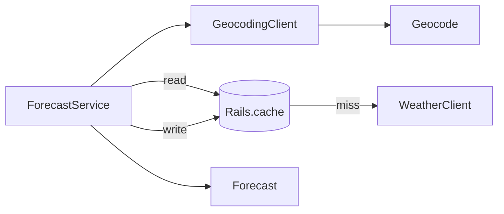

# Forecast App

A Rails application that provides weather forecasts based on address lookup using the Google Geocoding API.

## Installation

Requirements: 
- Ruby 3.4.2+
- Google Geocoding API Key

You can obtain an API key from the [Google Cloud Console](https://console.cloud.google.com/) with the Geocoding API enabled. Check out how to [set up Geocoding API](https://developers.google.com/maps/documentation/geocoding/get-api-key).

```sh
git clone https://github.com/iggredible/forecast-app.git
cd forecast-app
bundle install
```

Set your Google Geocoding API key:

```sh
export GOOGLE_GEOCODING_API_KEY=your_api_key_here
```

Start the Rails server:

```sh
bin/rails server
```

Go to http://localhost:3000 and enter a valid address, like _One Apple Park Way, Cupertino, CA 95014, U.S.A._ or _11 Wall Street New York, NY_

## Design Decisions

### Components

- ForecastService (`app/services/forecast_service.rb`): runs the full pipeline (facade)
- GeocodingClient (`app/clients/geocoding_client.rb`): converts addresses to coordinates using the geocoding API
- WeatherClient (`app/clients/weather_client.rb`): fetches weather data from Open-Meteo
- Forecast (`app/models/forecast.rb`): plain Ruby object holding forecast data
- Geocode (`app/models/geocode.rb`): plain Ruby object for geocoding data



### Design Patterns
`ForecastService` is a [facade](https://refactoring.guru/design-patterns/facade) and provides a simple interface that works with multiple subsystems. The controller calls `ForecastService#call(some_address)` and gets back a `Forecast` object. Behind the scenes, it:
1. Gets geocode information using `GeocodingClient`
2. Checks the cache by zip code
3. Fetches weather data via `WeatherClient` ([open-meteo](https://open-meteo.com/)) on a cache miss
4. Builds and returns a `Forecast` object

`ForecastService` uses dependency injection. It accepts keyword arguments:

```ruby
def initialize(
    geocoding_client: GeocodingClient.new,
    weather_client: WeatherClient.new,
    cache: Rails.cache
  )
```

In the app, `ForecastService.new` uses real clients with no arguments, while tests can inject fakes or mocks. It is easy to swap the geocoding client, weather client, or cache system in the future.

### Scalability

Get a list of top 100 zip codes. Perform a daily background job (like [Sidekiq](https://sidekiq.org/)) to pre-fetch weather data for this list. When a user performs a search, there is a good chance the result is already cached! This would reduce external API calls and improve response times.

When/if the app actually has proper CSS and other static assets, store them on a CDN with multiple regions.

Implement a load balancer to distribute traffic across servers.

Switch to Redis caching so multiple app instances can share a single cache. A shared in-memory store makes caching consistent across all servers.

### Future improvements

Add a chain of fallback weather API services so when one service fails, the system automatically tries the next one. Each provider will implement the same interface. A wrapper can be added to try them in order, something like `FallbackWeatherClient.call(lat, lng)`.

Implement circuit breakers so that when Open Meteo goes down, the system fails fast instead of waiting for timeouts. After N consecutive failures, the user would see "Weather service is temporarily unavailable" instead of waiting.

Add a second cache for geocoding results. The key will probably contain some type of normalized form of the address. The geocoding cache can have a longer TTL (weeks or longer) because addresses don't change that often.

## Misc

For screenshots of what the app looks like when running, check the [wiki page](https://github.com/iggredible/forecast-app/wiki/Example-pages).

